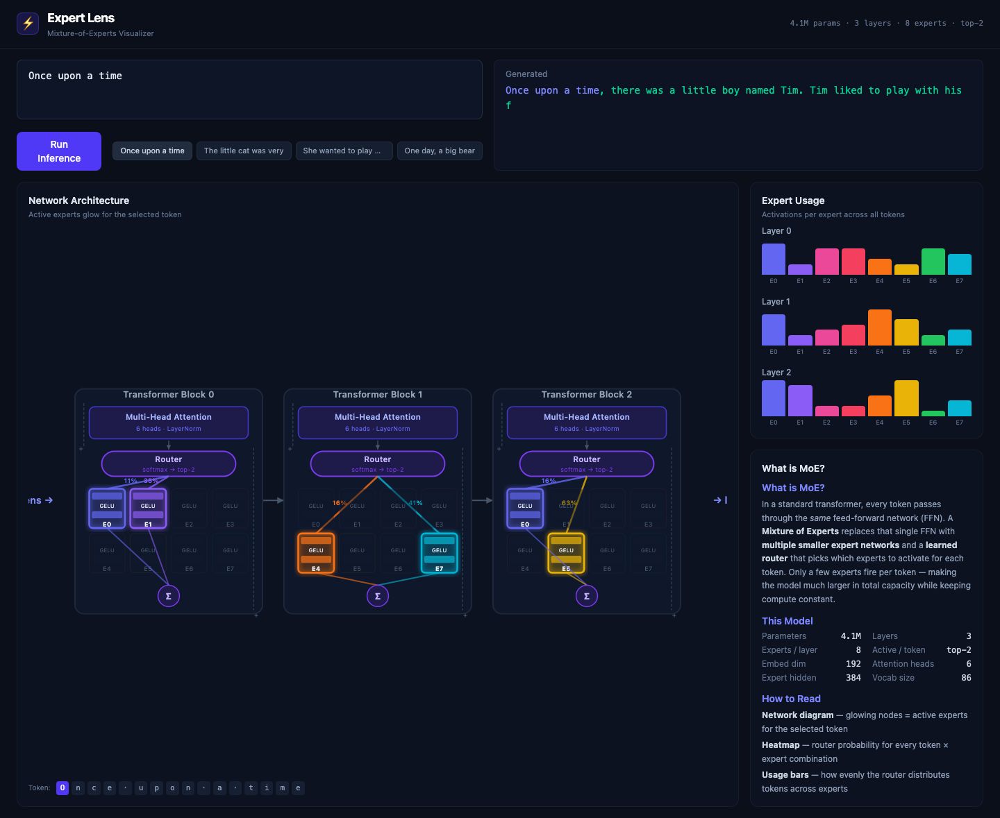
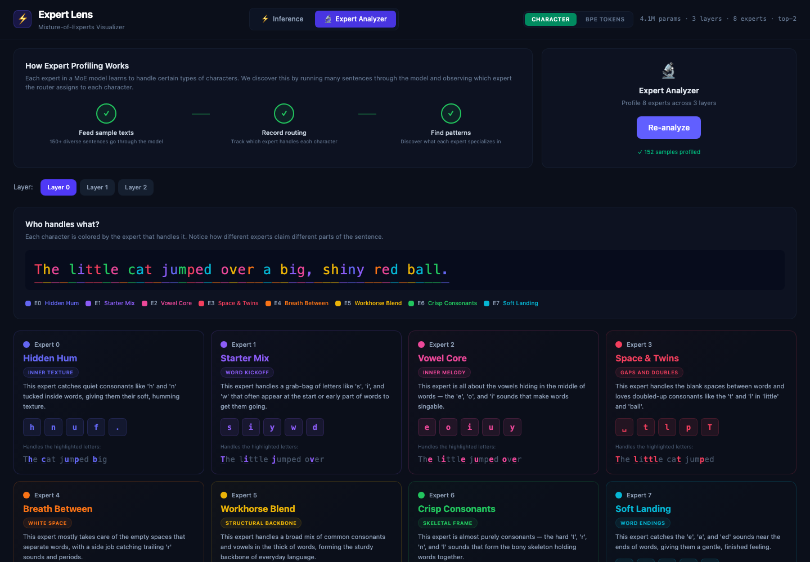

# ⚡ Expert Lens

**Interactive Mixture-of-Experts (MoE) Visualizer**

See how a neural network *routes* different tokens to different expert sub-networks in real time. Built from scratch — model, training, and UI — to visually explain what MoE is and why it matters.

Switch between **character-level** and **BPE (subword) tokenization** to see how tokenization strategy shapes expert specialization.



## What is MoE?

In a standard transformer, every token passes through the **same** feed-forward network (FFN). A **Mixture of Experts** replaces that single FFN with multiple smaller expert networks and a **learned router** that picks which experts to activate for each token. Only a few experts fire per token — making the model much larger in total capacity while keeping compute constant.

This is the pattern behind **Mixtral**, **GPT-4** (rumored), **Qwen-MoE**, and other frontier models.

## Architecture

```
Input tokens
     │
Embedding + Positional Encoding
     │
┌────┴────┐
│   MoE   │ × 3 layers
│  Block  │   LayerNorm → Flash Attention → LayerNorm → MoE FFN
└────┬────┘
     │
LayerNorm → Linear → Softmax (next-token prediction)
```

Each **MoE FFN** contains:
- A **router** (linear → softmax) that scores every expert
- **8 expert** feed-forward networks (small 2-layer MLPs)
- **Top-2 selection** — only 2 experts activate per token
- **Load-balancing loss** to prevent expert collapse

**Model**: 4M parameters · 3 layers · 8 experts · top-2 routing
**Tokenization**: Two modes — **character-level** (86 tokens) and **BPE subword** (512 tokens)
**Data**: [TinyStories](https://huggingface.co/datasets/roneneldan/TinyStories) (Microsoft Research) — simple stories that produce coherent text even from tiny models
**Splits**: 80% train · 10% validation · 10% test

## Quick Start

### Prerequisites

- Python 3.10+ (with `venv`)
- Node.js 18+
- macOS with Apple Silicon recommended (uses MPS GPU), but CPU works too

### One-command quick start

Pre-trained weights are included — no training needed:

```bash
git clone git@github.com:sagy101/Expert-Lens.git
cd Expert-Lens
make install   # creates venv + installs Python & Node deps
make dev       # starts backend (:8000) + frontend (:5173)
```

Open **http://localhost:5173** — type text, click "Run Inference", and watch the experts light up.

### Step by step

```bash
# 1. Clone
git clone git@github.com:sagy101/Expert-Lens.git
cd Expert-Lens

# 2. Backend (isolated venv)
python3 -m venv backend/.venv
backend/.venv/bin/pip install -r backend/requirements.txt

# 3. Frontend
cd frontend && npm install && cd ..

# 4. Run (two terminals)
cd backend && ../backend/.venv/bin/python3 -m uvicorn app:app --host 127.0.0.1 --port 8000
cd frontend && npm run dev
```

### Re-train from scratch (optional)

If you want to train the models yourself instead of using the included weights:

```bash
# Character-level model
backend/.venv/bin/python3 backend/train.py --epochs 30

# BPE tokenizer + model (trains tokenizer first, then model)
backend/.venv/bin/python3 backend/train_bpe.py --epochs 30
```

Automatically downloads TinyStories, trains with progress bars, and runs a final test evaluation.

## Configuration

To enable **LLM-powered expert labeling** (where an LLM reads the routing patterns and names the experts), you need to provide access to an OpenAI-compatible LLM API.

1.  Create a `.env` file in the root directory:
    ```bash
    cp .env.example .env
    ```

2.  Add your API keys:
    ```ini
    LITELLM_URL="https://your-llm-endpoint.com"  # Base URL for the LLM API
    LITELLM_KEY="sk-..."                         # Your API key
    LITELLM_MODEL="anthropic.claude-3-opus"      # Model to use (optional, defaults to claude-opus)
    ```

If these are not provided, the "Expert Analyzer" will use programmatic fallback labels (e.g., "Consonant Expert") instead of rich LLM-generated descriptions.

## Visualizations

- **Model Toggle** — switch between character-level and BPE tokenization in the header to compare how tokenization affects expert specialization
- **Network Diagram** — animated SVG showing the full architecture; active experts glow with color-coded connections when you select a token
- **Expert Usage** — bar charts showing how evenly the router distributes tokens across experts (load balancing in action)
- **Token Selector** — click any input token to see which experts it routes to across all layers
- **Generated Text** — input shown in purple, generated continuation in green
- **Expert Analyzer** — profile all experts across all layers; LLM-generated labels describe each expert's specialization



## Tech Stack

| Layer | Technology |
|-------|-----------|
| Model | PyTorch (from scratch) |
| Training | MPS/CUDA + AMP + Flash Attention |
| Backend | FastAPI |
| Frontend | React + TypeScript + Vite |
| Styling | TailwindCSS |
| Animations | Framer Motion |
| Data | TinyStories (HuggingFace) |

## Project Structure

```
expert-lens/
├── backend/
│   ├── moe_model.py      # MoE transformer (from scratch)
│   ├── train.py           # Character-level training script
│   ├── train_bpe.py       # BPE tokenizer + model training
│   ├── app.py             # FastAPI API (serves both models)
│   ├── llm_labeler.py     # LLM-powered expert labeling
│   ├── samples.py         # Sample texts for expert profiling
│   └── requirements.txt
├── frontend/
│   ├── src/
│   │   ├── App.tsx                    # Main layout
│   │   ├── components/
│   │   │   ├── InferenceView.tsx      # Inference tab
│   │   │   ├── AnalyzerView.tsx       # Expert profiling tab
│   │   │   ├── NetworkDiagram.tsx     # Animated SVG architecture
│   │   │   ├── ExpertUsage.tsx        # Expert activation bars
│   │   │   ├── TextInput.tsx          # Input + example prompts
│   │   │   └── InfoPanel.tsx          # Educational annotations
│   │   └── lib/api.ts                # API client + types
│   └── package.json
├── scripts/screenshot.py
├── Makefile
└── README.md
```

## License

[MIT](LICENSE)
